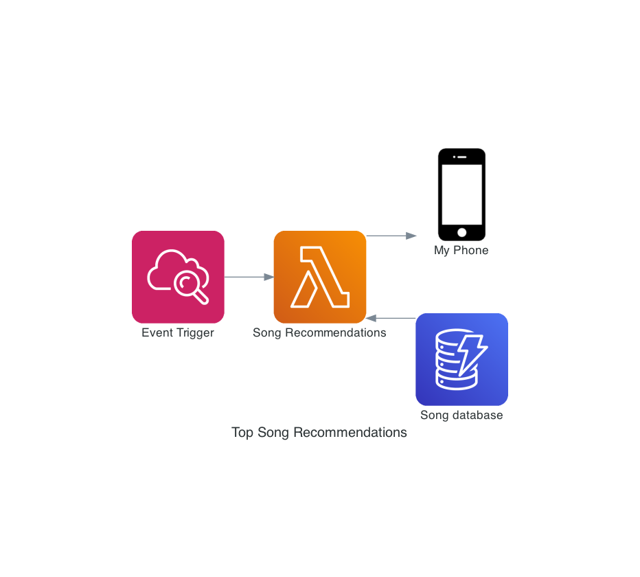

# tu-musica

## Description

Spotify has these recommended playlists that contains songs that match closely to music
that you usually listen to on the daily basis.

The problem with these playlists is that they are not given frequently, which is the
problem that I am trying to solve by using the Spotify's api and Twilio

## Diagram

## Resources

- https://levelup.gitconnected.com/10-tools-i-use-to-craft-better-python-code-b9a9776a7871
- https://www.pythoncentral.io/introductory-tutorial-python-sqlalchemy/
- https://github.com/simonw/datasette
- https://spotipy.readthedocs.io/en/2.16.1/
- https://github.com/plamere/spotipy/tree/master/examples
